# 자산거래중개장터의 시맨틱 검색 및 GIS 기반 능동형 중개 시스템 고도화 제안


<strong>중소벤처기업진흥공단 이사장 표창 수상</strong>
<br><br>

<strong>빅데이터혁신융합대학사업단 사업단장 장려상 수상</strong>

## 제5회 AI·공공데이터 활용 및 창업 경진대회 공모전 출품작

본 프로젝트는 기존 RDB 기반 문자열 일치 검색의 한계로 인해 발생하는 중소기업 유휴자산 거래의 '시장 실패' 문제를 해결하고, 지리적 접근성을 고려한 시각화 및 실시간 수요 대응형 파이프라인을 구축하여 B2B 순환 경제 생태계를 조성을 목표로 한다.

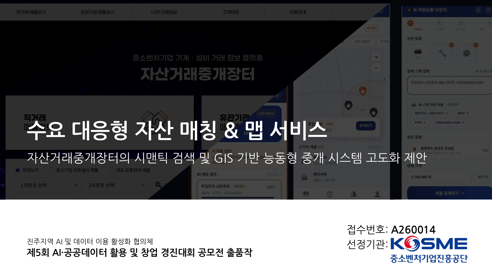

## 프로젝트 주요 성과

### 기술 측면

* **LLM & Vector DB 기반 하이브리드 검색 인프라 구축:** 비정형 기계 사양 텍스트의 문맥적 의미 파악을 위해 **Anthropic Claude 3.5 Sonnet**과 **AWS Cohere Embed v4**를 연동하여 전문 산업 용어의 의미론적 유사도 연산을 구현했습니다.
* **초개인화 시맨틱 파이프라인 설계:** 구매자의 자연어 요구사항을 LLM이 구조화된 사양(전압, 마력 등)으로 변환 후, **AWS OpenSearch**를 통해 코사인 유사도 점수를 계산하는 고차원 벡터 검색 시스템을 구축했습니다.
* **대용량 지리 정보 처리(GIS) 최적화:** 중량물 거래 특성을 반영하여 **PostGIS(PostgreSQL)** 및 지도 API를 연동, 수천 건의 매물 좌표 간 실시간 반경 계산 및 클러스터링을 최적화하여 프론트엔드 렌더링 병목을 제거했습니다.
* **이벤트 드리븐 역방향 매칭 큐(Queue) 구현:** 구매자가 등록한 '삽니다' 수요를 대기열로 관리하고, 신규 매물이 등록되는 즉시 스펙 유사도와 거리를 실시간으로 동시 연산하여 알림을 Push하는 비동기 파이프라인을 설계했습니다.

### 서비스 측면

* **공공 시스템의 '시장 실패' 혁신:** 단순 나열식 게시판 형태의 공공 플랫폼을 **수요 대응형(Demand-Driven) 플랫폼**으로 전환하는 디지털 대전환 모델을 제시했습니다.
* **비용 절감 및 거래 성사율 극대화:** 키워드 불일치 문제를 해결하여 악성 재고의 회전율을 높이고, 직관적인 거리 파악 UI를 통해 중소기업 중고 거래의 가장 큰 장벽인 **'화물 물류비 및 이전 설치비' 의사결정 시간을 혁신적으로 단축**시켰습니다.
* **ESG 경영 및 탄소 배출 저감 기여:** 가용 산업 기계가 고철로 폐기되는 것을 방지하고, 근거리 거래 매칭을 유도함으로써 대형 화물 트럭 운송 시 발생하는 탄소 배출량(Carbon Footprint)을 줄이는 친환경 지속가능 생태계를 전략적으로 마케팅했습니다.

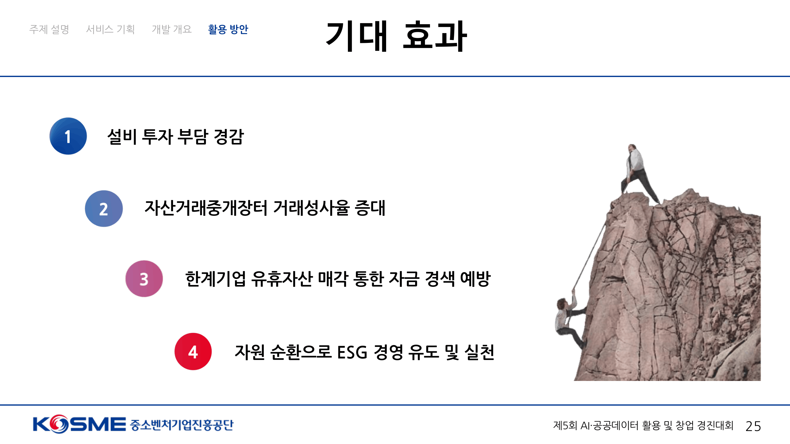

## 제안 기술 스택

| 분류 | 기술 기술 및 도구 |
| :--- | :--- |
| **Frontend** | React, TypeScript, Kakao/Naver Map API, Tailwind CSS |
| **Backend** | Node.js (NestJS), TypeScript, Python (FastAPI) |
| **AI / NLP** | Anthropic Claude 3.5 Sonnet, AWS Cohere Embed v4, LangChain |
| **Database** | PostgreSQL (PostGIS), AWS OpenSearch (Vector DB) |
| **DevOps / Infra** | AWS (VPC, EC2, RDS), GitHub Actions, Docker |

## 시스템 아키텍처

```
[Buyer (Client)] ---> (Natural Language Request + GIS) ---> [NestJS Backend]
|
(Forward Text Query)
v
[AWS OpenSearch] <--- (Hybrid Vector Search) <----------- [FastAPI AI Server]
+                                                           |
[PostGIS]                                              (Claude 3.5 + Cohere)
```

1. **구매자 요구사항 등록:** 자연어로 작성된 요구사항과 물리적 공장 주소 연동.
2. **NLU 사양 추출:** LLM이 자연어에서 핵심 엔티티(카테고리, 용량, 스펙)를 정형화된 벡터로 변환.
3. **하이브리드 매칭 및 가중치 랭킹:** 벡터 데이터베이스의 코사인 유사도 점수와 PostGIS 기반 지리적 근접성 점수를 가중 합산하여 최적의 상위 매물 스코어링.
4. **역방향 실시간 알림:** 적합 매물이 없을 시 '수요 대기열'에 보관되며, 신규 매물 입고 시 즉시 실시간 역매칭 푸시 발송.

## 데이터 활용

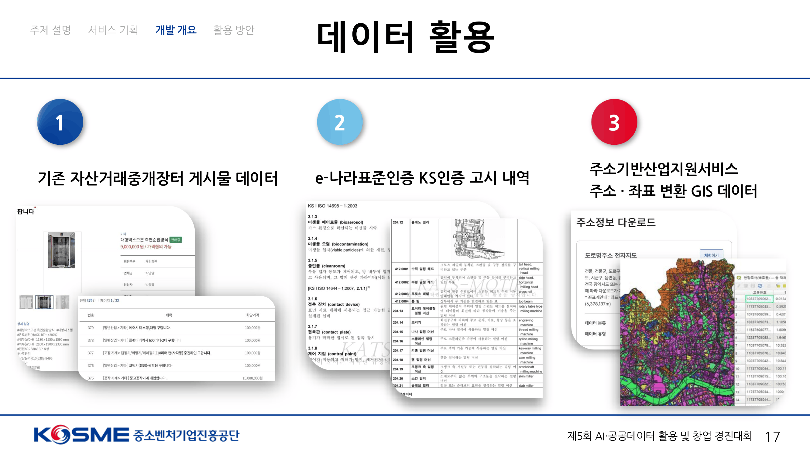
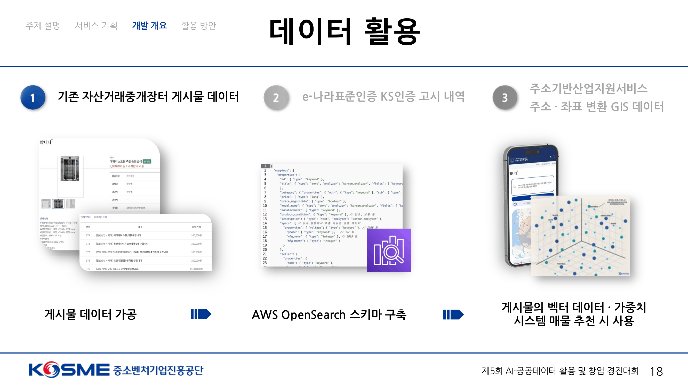
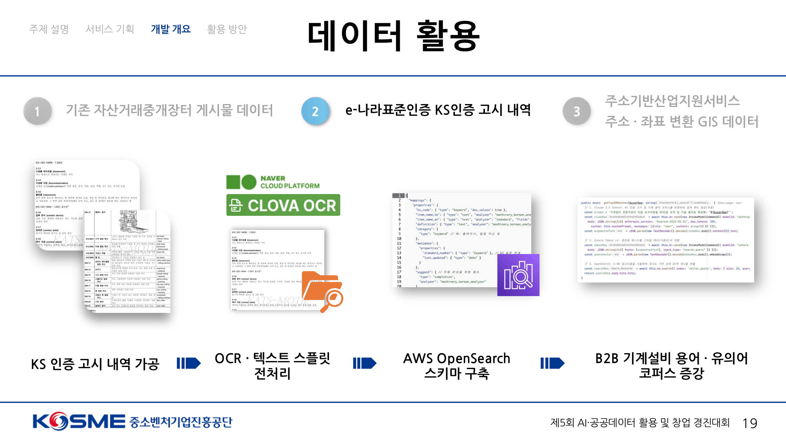
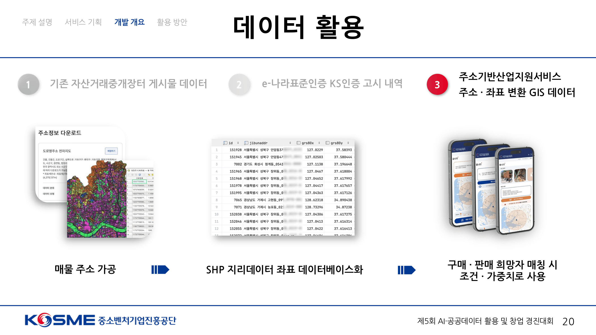

## 유사서비스 분석

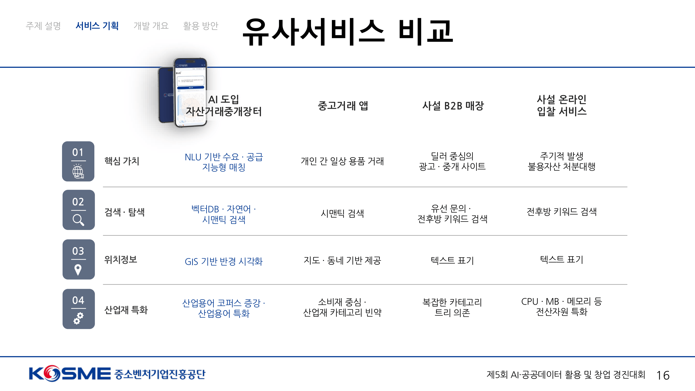

## 서비스 UI/UX

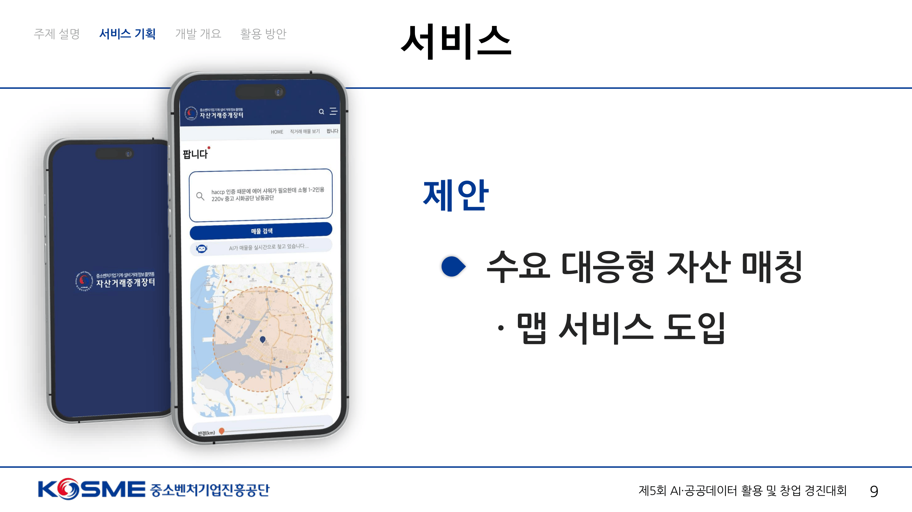
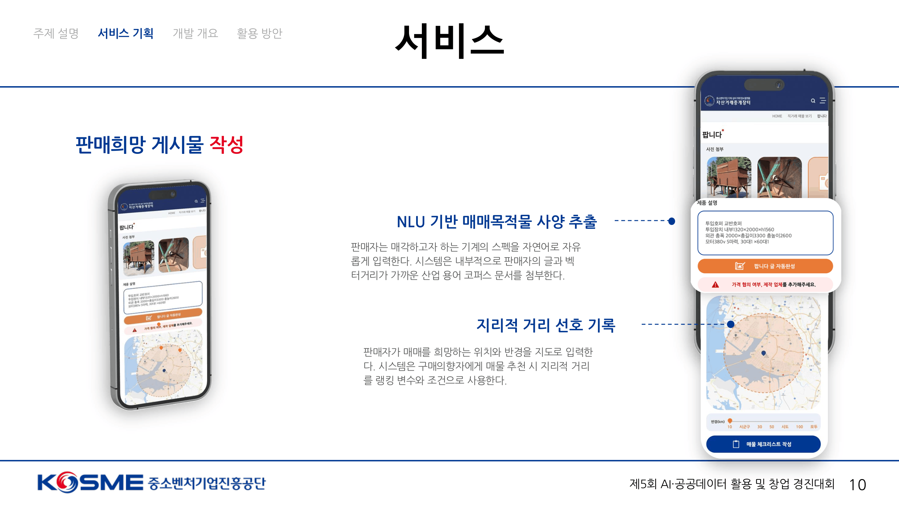
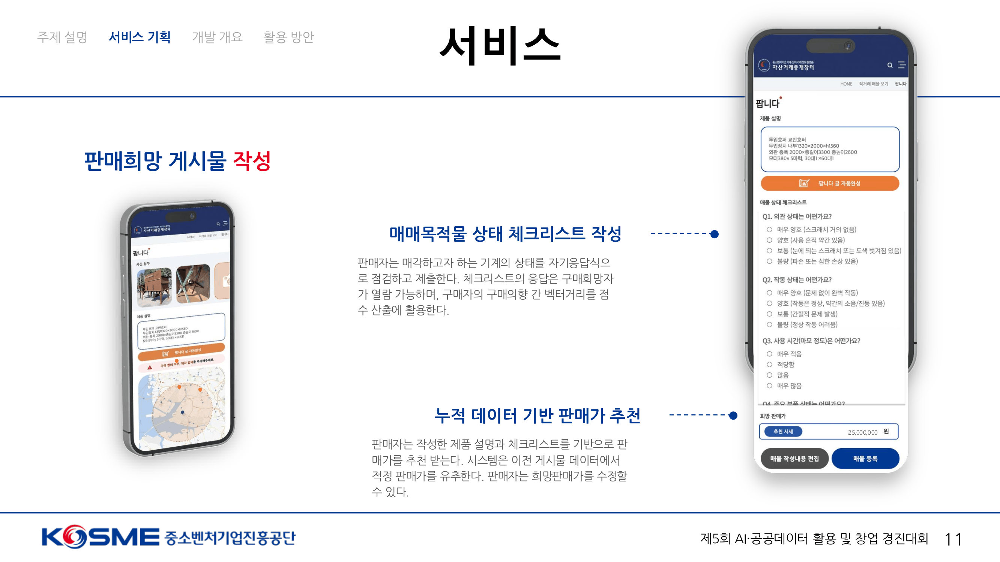
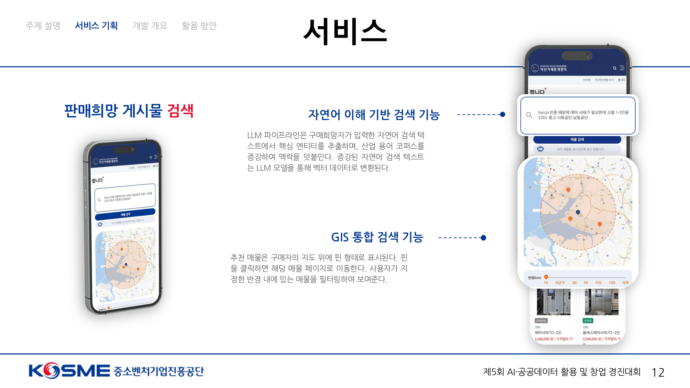
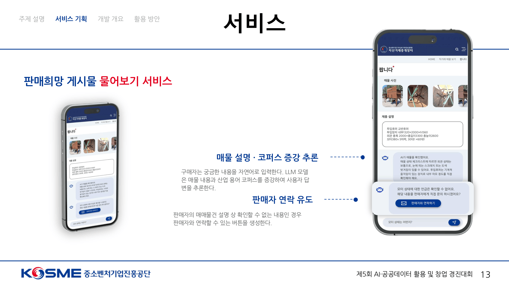
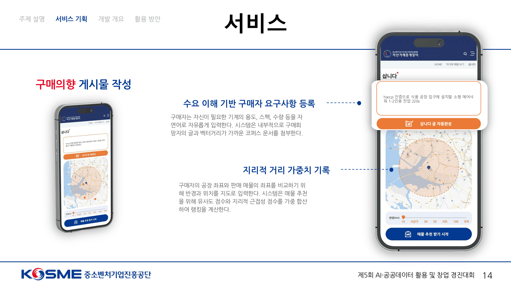
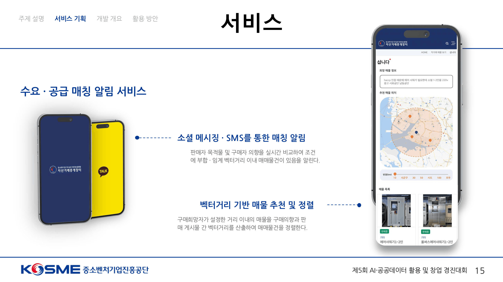